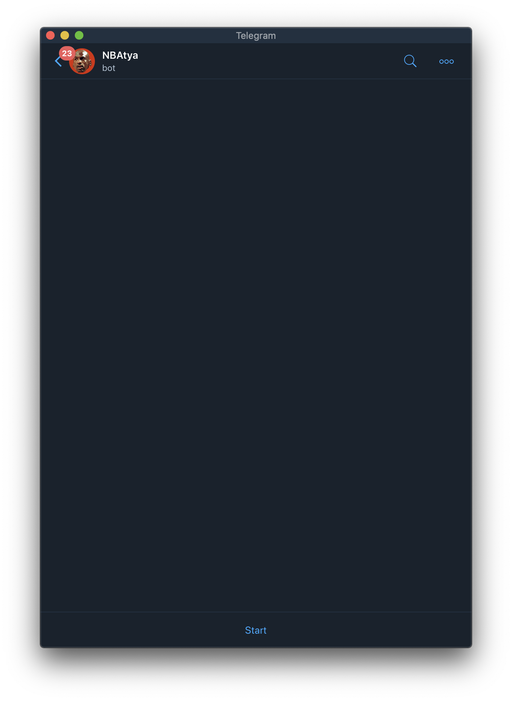

# NBAtya

### Usage

Example of bot's usage

[](https://youtu.be/i_xZYm6-HkI)

### Development

#### Preparations before run

For starting service, insert necessary `dump.sql` file with dump of tables, correspoding schemas in `init.sql` into `resources` folder and
insert NBAtyaBot's **Telegram token** into `config.py` file in place of `Your token here` text.
If you use bot in first time, add it by [link](https://t.me/NBAtyaBot).

#### Running

All necessary functions are provided by `Make` build automation.
To view their list with corresponding definitions, run command:
```
make help
```
